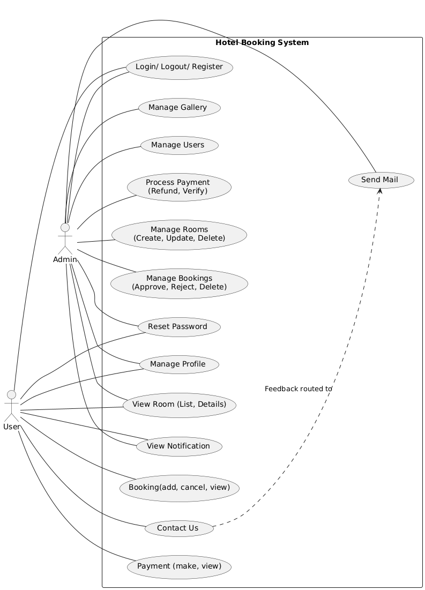
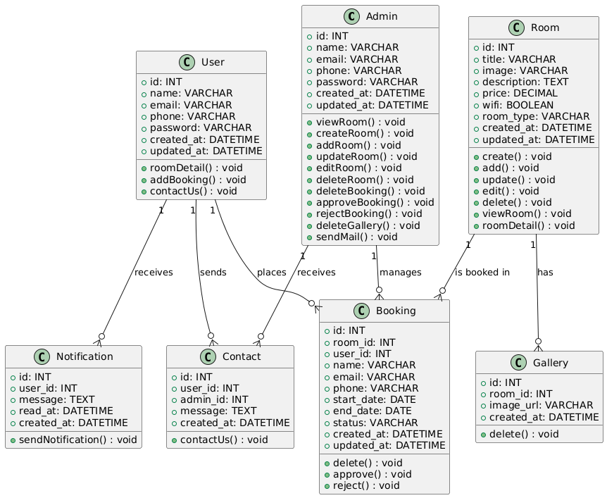
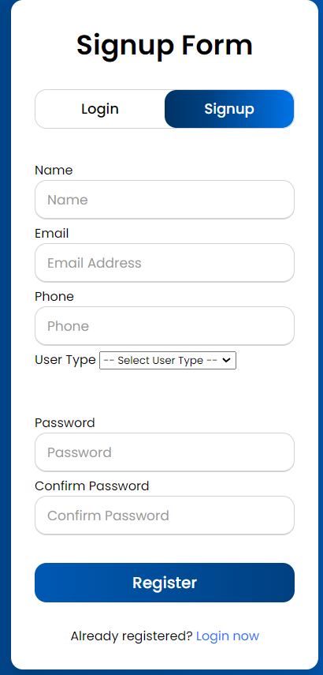
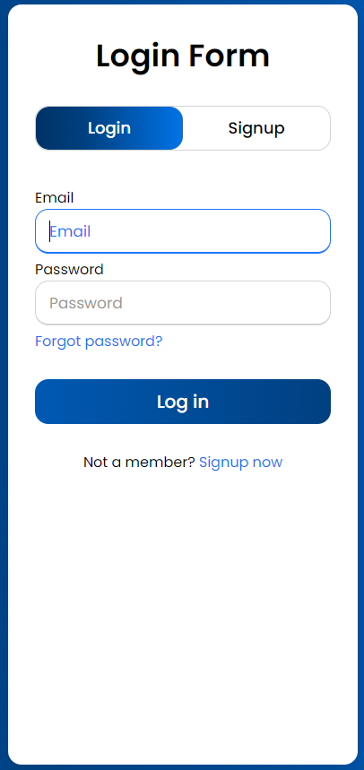
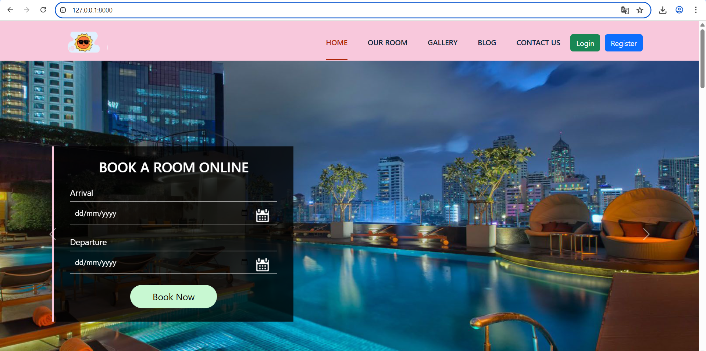
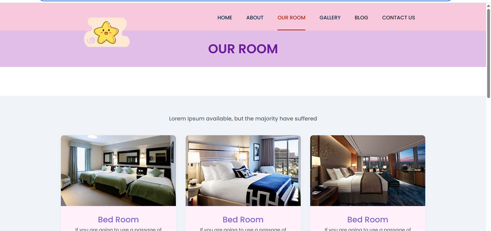
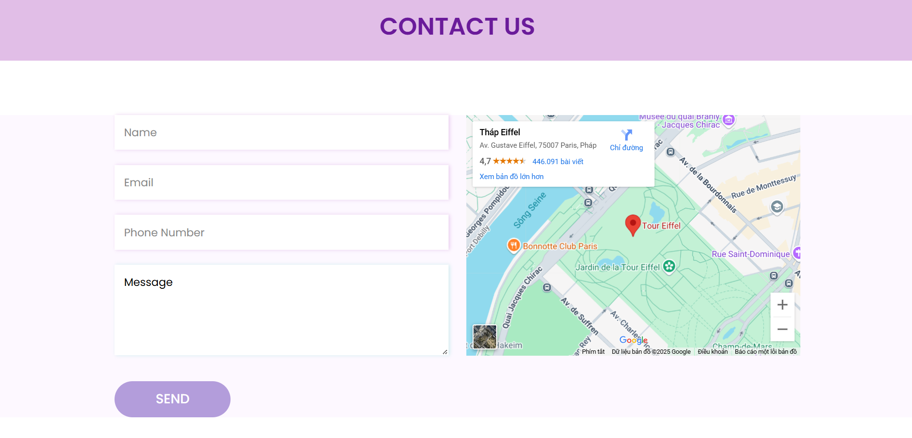
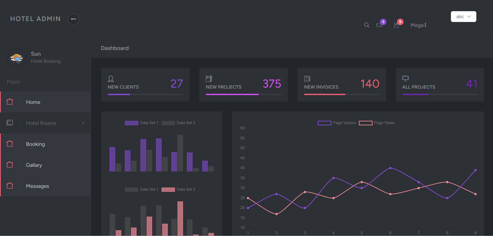
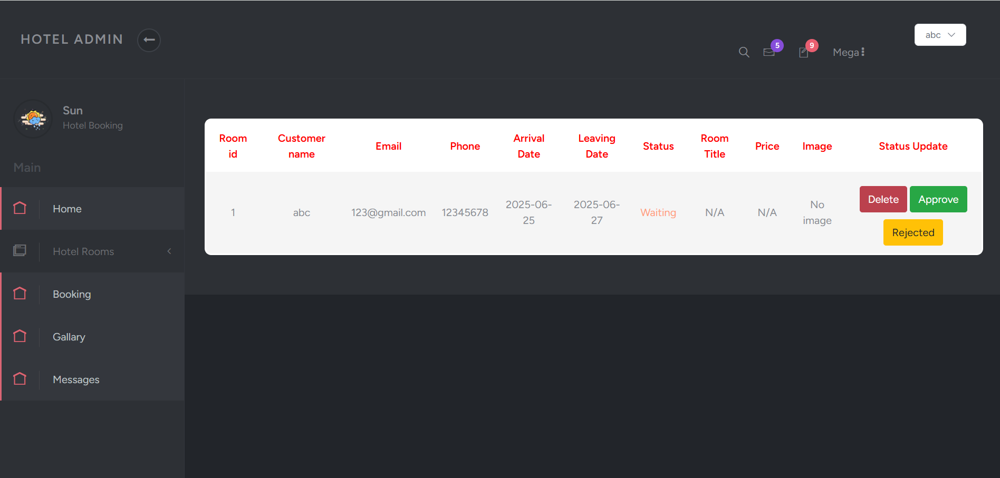
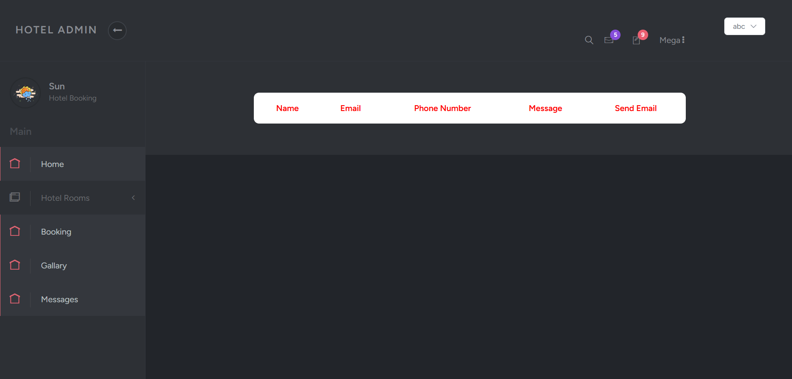

# Hotel Booking System

## 📝 Mô tả ngắn gọn
Hệ thống đặt phòng khách sạn trực tuyến cho phép khách hàng dễ dàng tìm kiếm, đặt phòng và theo dõi thông tin đặt phòng. Đồng thời, hỗ trợ quản trị viên quản lý phòng, đơn đặt và thông tin khách hàng hiệu quả.

## ✨ Các tính năng chính
- Đăng ký & Đăng nhập người dùng
- Tìm kiếm và đặt phòng khách sạn
- Quản lý đặt phòng của người dùng
- Quản lý phòng, dịch vụ và đặt phòng dành cho quản trị viên
- Thanh toán trực tuyến (tùy chọn)
- Hệ thống đánh giá và phản hồi

## 🛠 Công nghệ sử dụng
- **Framework:** Laravel 10
- **Ngôn ngữ:** PHP
- **Cơ sở dữ liệu:** MySQL
- **Local Server:** XAMPP
- **Frontend:** Blade Template, Bootstrap


## 🚀 Cài đặt và chạy dự án
### 1️⃣ Clone repository
```sh
git clone https://github.com/QuynhAnh-31/project
cd hotelbooking
```

### 2️⃣ Cài đặt dependencies
```sh
composer install
npm install
npm run build
```

### 3️⃣ Cấu hình môi trường
```sh
cp .env.example .env
php artisan key:generate
```
Cập nhật file `.env` với thông tin kết nối database. Ngoài ra, có thể nhập dữ liệu mẫu từ file `hotel2.sql` vào database để thuận lợi cho việc deploy sản phẩm

### 4️⃣ Chạy migrations
```sh
php artisan migrate
```

### 5️⃣ Khởi động server
```sh
php artisan serve
```
Sau đó truy cập `http://127.0.0.1:8000/`

## Biểu đồ database


## Biểu đồ database



## 📸 Ảnh giao diện
Dưới đây là một số hình ảnh về giao diện của hệ thống:


### Đăng ký/ Đăng nhập
|  |  |
|----------------------|----------------------|


### 🌍 Trang chủ


### 🏨 Trang đặt phòng


### Trang feedback


### 🔧 Trang quản trị


### 🔧 Trang quản trị đặt phòng


### 🔧 Trang quản trị phản hồi



## 🔚 Tổng kết
Hệ thống đặt phòng khách sạn giúp đơn giản hóa quy trình đặt phòng, mang lại trải nghiệm tiện lợi cho người dùng và hỗ trợ quản lý hiệu quả cho chủ khách sạn. Được xây dựng bằng Laravel, PHP và MySQL, hệ thống đảm bảo tính linh hoạt, bảo mật và hiệu suất ổn định. Dự án hứa hẹn sẽ tiếp tục được phát triển và mở rộng với nhiều tính năng hữu ích trong tương lai.
